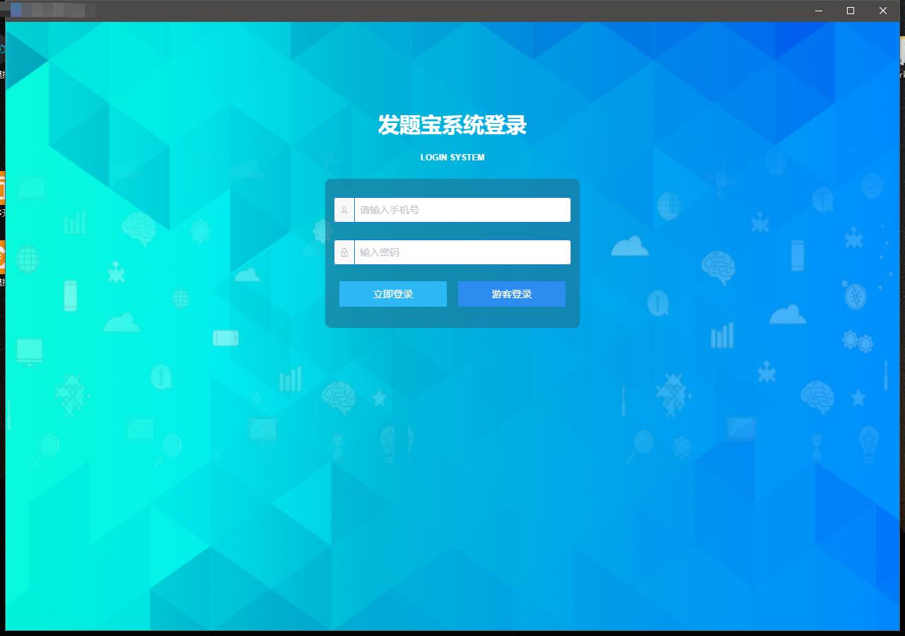
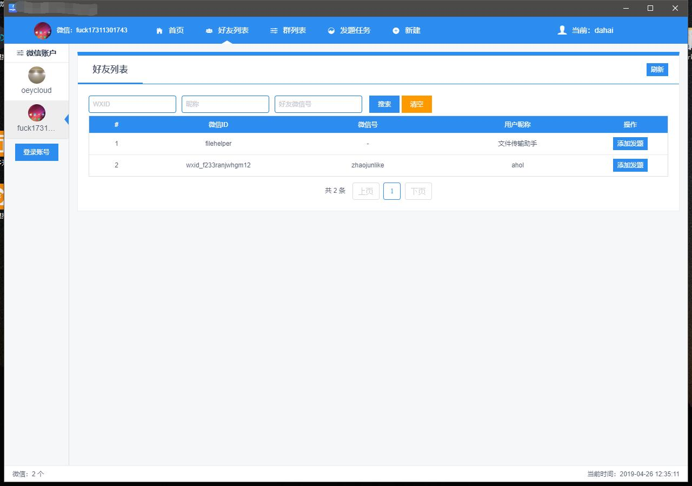

## 微信 2.6.6.28 核心

pc hook 的websocket api 包装

## 支持功能如下：
-   微信多开
-   消息接受
-   消息发送
-   好友列表
-   群列表
-   群成员列表
-   微信个人信息
-   当前登录状态

## API 接口
支持websocket api

事件如下：
-   wx.login
-   wx.logout
-   wx.send_message
-   wx.send_text_message
-   wx.send_card_message
-   wx.get_users
-   wx.get_group_users

## UI

## 协议

此DLL仅供研究hook学习使用，请勿商业用途，或者其他非发用途，克隆或者下载此项目表示你已经看到了这些说明，出现任何法律纠纷与本人无关，技术交流开发QQ群：486574713

## 支持我

打赏我喝杯咖啡怎么样？？

